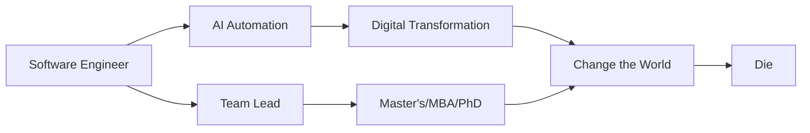

  

  

<h2 align="center">🚀 Software Engineer | Team Leader</h2>

  
  
  
  

  
  

---

### 📊 GitHub Statistics & 🏆 Achievements

  
  

  

  

---

### 👨‍💻 About Me

<table>
<tr>
<td width="50%" valign="top">

#### 👔 Professional Journey

 

| 🎯 Current Role | Details                              |
| :-------------- | :----------------------------------- |
| **Position**    | 🚀 Mobile Team Lead                  |
| **Location**    | 🇻🇳 Ho Chi Minh City, Vietnam         |
| **Education**   | 🎓 Software Engineering @ HCMUS, VNU |
| **Specialty**   | 📱 React Native Mobile Development   |

</td>
<td width="50%" valign="top">

#### 💼 Core Expertise

🏆 **Leadership & Development**

- Leading mobile development teams
- Architecting scalable React Native apps
- Mentoring developers & code reviews

🤖 **AI & Automation**

- Building intelligent workflow automation (n8n)
- Reducing manual labor with AI solutions
- Digital transformation implementations

🛠️ **Tech Stack**

- Mobile: React Native, Flutter, Swift
- AI/Automation: n8n, AI Integration
- Backend: Node.js, RESTful APIs
- Cloud: Firebase, AWS

</td>
</tr>
</table>

---

### 🎯 What Drives Me

<table>
<tr>
<td width="33%" align="center">

### 🤖 AI Innovation

Passionate about leveraging AI to **automate workflows** and **reduce human labor**. Building intelligent systems that work smarter, not harder.

</td>
<td width="33%" align="center">

### 📱 Mobile Excellence

Leading teams to create **exceptional mobile experiences** with React Native. From concept to deployment, delivering apps that users love.

</td>
<td width="33%" align="center">

### 🚀 Digital Transformation

Developing **enterprise solutions** that modernize businesses. Turning traditional processes into efficient digital workflows.

</td>
</tr>
</table>

---

### 💡 Current Focus

| 🔨 Building                        | 🎓 Learning                     | 🎯 Goals                           |
| :--------------------------------- | :------------------------------ | :--------------------------------- |
| 🤖 AI-powered automation platforms | ☁️ Advanced cloud architecture  | 🌍 Scale AI solutions globally     |
| 📱 Enterprise React Native apps    | 🧠 Machine learning integration | 👥 Grow engineering teams          |
| 🔄 Digital transformation tools    | 🚀 DevOps & CI/CD optimization  | 📚 Share knowledge through writing |

---

### 🎨 Beyond Code

**⚽ Soccer Enthusiast** • **📸 Photography Lover** • **🎮 Gamer** • **💻 Tech Explorer**

_When I'm not leading teams or building AI solutions, you'll find me on the soccer field, capturing moments through my lens, or exploring the latest tech trends._

---

### 🛠️ Tech Stack & Tools

#### Languages

#### Frameworks & Libraries

#### Tools & Platforms

---

### 💼 Featured Projects

---

### 📈 Coding Activity

<!--START_SECTION:waka-->
<!--END_SECTION:waka-->

---

### 💡 Quote of the Day

---

### 🎯 Current Goals

- 🚀 Contribute to more open-source projects
- 📱 Master advanced React Native animations and state management
- 🌐 Build scalable full-stack applications
- 🎓 Share knowledge through technical writing and mentoring
- 🔧 Explore cloud architecture and DevOps practices

---

### 📫 Let's Connect!

I'm always open to interesting conversations and collaboration opportunities!

**📧 Email:** [thuctrieu.work@gmail.com](mailto:thuctrieu.work@gmail.com)
**💼 LinkedIn:** [linkedin.com/in/thuctmn](https://www.linkedin.com/in/thuctmn/)
**📱 Phone:** [+84 384 987 812](tel:+84384987812)
**👥 Facebook:** [facebook.com/ngocthuc.037](https://facebook.com/ngocthuc.037)

---

  

### ⭐ Show some love by starring some repositories!

